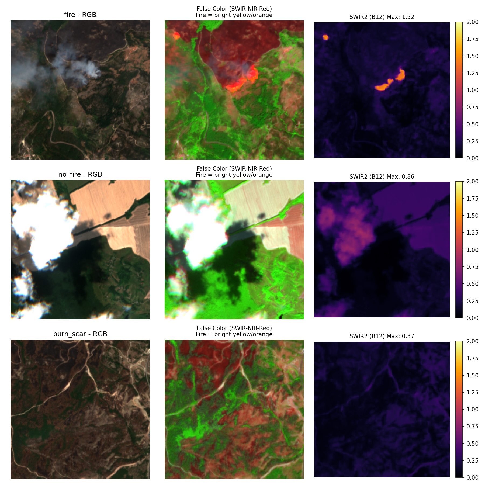

# Wildfire Detection (Sentinel-2)

Small, focused pipeline to build a 3-class dataset (fire / no_fire / burn_scar) from FIRMS + Sentinel-2, and train ResNet classifiers.

## Quick Start
- Install: `pip install -r requirements.txt`
- Configure `.env` with Sentinel Hub creds (`SH_CLIENT_ID`, `SH_CLIENT_SECRET`)
- Pipeline:
  1) `python scripts/build_candidates.py`
  2) `python scripts/download_dataset.py`
  3) `python scripts/prepare_splits.py`
- Train:
  - RGB: `python models/train_resnet.py`
  - 6-band: set `EXPERIMENT="all"` in `train_resnet.py`

## What you get
- Data in `data/splits/` (train/val/test), bands: B02,B03,B04,B08,B11,B12
- Quality filters: cloud/water/valid pixels + thermal (B12) thresholds
- Geographic split to avoid spatial leakage

## Key Files
- `scripts/build_candidates.py` — match FIRMS to S2 catalog
- `scripts/download_dataset.py` — download patches + metadata
- `scripts/prepare_splits.py` — filter, balance, and split
- `models/dataset.py` — PyTorch dataset + transforms
- `models/train_resnet.py` — RGB/6-band training (ReduceLROnPlateau, dropout, label smoothing)

## Notes
- MPS/Metal and CUDA are auto-detected.
- Checkpoints saved to `models/checkpoints/`.
- For detailed steps, see `DATA_PIPELINE.md`.

